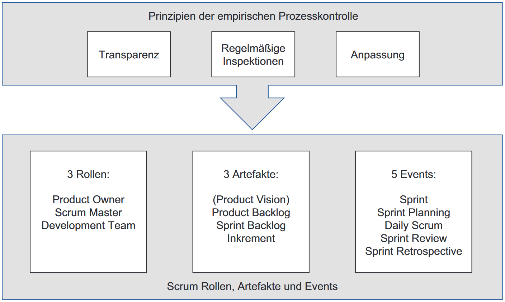
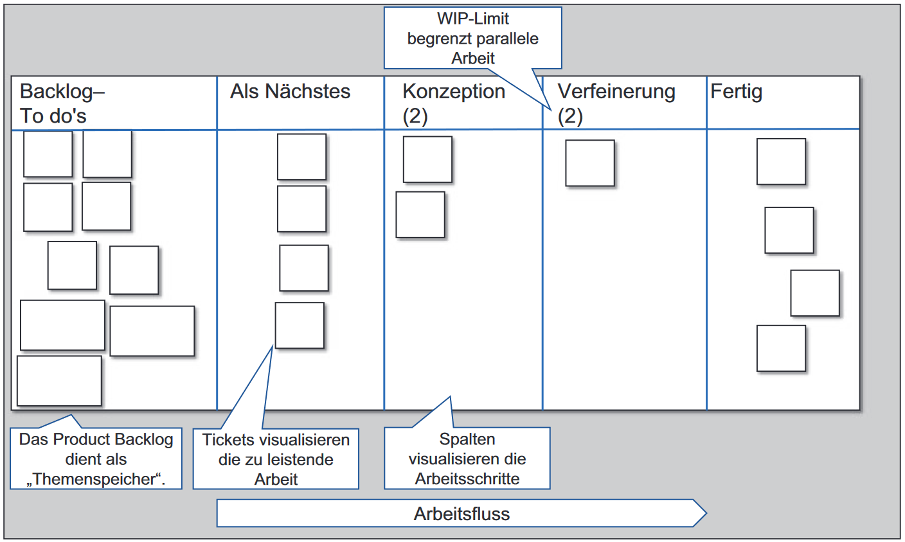

class: center, middle

## [Software Projektmanagement](index.html)

#### Kapitel 3

# Ansätze zum Projektmanagement

---
# "klassisches" Projektmanagement

* plangetriebener (prognostizierter) Ansatz
* erfolgreich wenn Scope, Qualität, Zeit und Kosten sich wie geplant entwickelt haben

---
# agiles Projektmanagement

* **Value** (Wert) im Vordergrund:
   1. bestimmt bestimmt den Inhalt und Umfang
   2. agile Werte

* am weitesten verbreitete Methoden:
   * **Scrum**
   * **Kanban**

* Phasen des Projektlebenszyklus:
   * Analyse
   * Design
   * Umsetzung
   * Test
   * Lieferung

---
# Scrum

---
# Kanban

