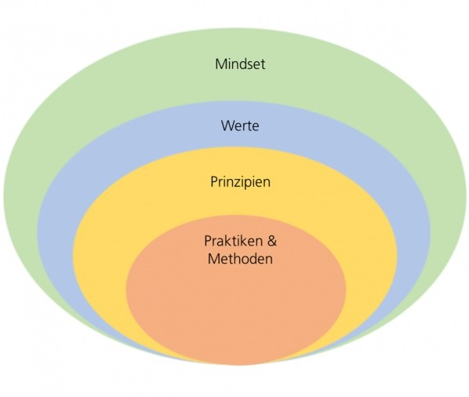
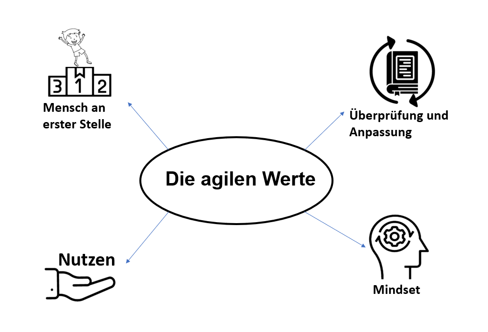
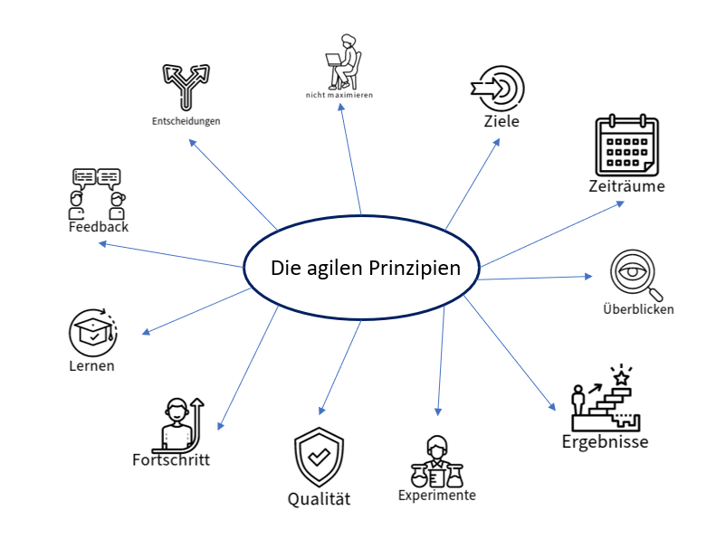
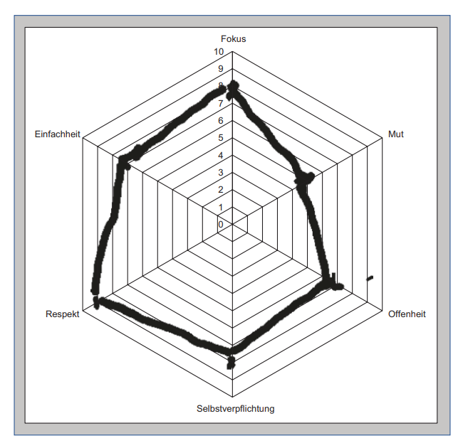

class: center, middle

## [Software Projektmanagement](index.html)

#### Kapitel 4

# Das agile Wertesystem und Mindset

Marlon Cadell

---
class: center
# Die Agile Zwiebel

---
class: center, middle
# Das agile Mindset

???
* Die Werte – was man in einer gegebenen Situation für am wichtigsten hält,
* Unsere Glaubenssätze – was wir für richtig („wahr“) halten,
* Die Prinzipien, die als Leitlinien unsere Arbeit und Entscheidungen steuern.

---

???
* beruhen auf dem im Agilen Manifest

* Menschen an erster Stelle, vor Produkt und vor Prozess.
* * geht nicht nur um das Team, sondern um alle Stakeholder inklusive Kunden und Anwender

* Überprüfung und Anpassung (Inspect and Adapt)
* * Veränderungen sind oft notwendig und können positiv sein. Lernen und Weiterentwickeln auf der Basis von Feedback.

* Frühe und häufge Lieferung von Nutzen:
* * Die Arbeit soll möglichst immer so geplant und gestaltet werden, dass durch Lieferungen ein Nutzen für den Kunden und gleichzeitig für das Unternehmen möglich ist.

* Glaubenssätze
* * wovon Sie überzeugt sind, auch wenn es sich nicht wirklich beweisen lässt

---

???
* Wo immer möglich werden kurze Feedback-Schleifen genutzt.

* Das fortlaufende Lernen wird betont:
* * Lernen über den Kunden und seine Bedürfnisse

* Die Ziele des Business:
* * durch häufge Lieferungen,
* * durch Verlässlichkeit,
* * durch niedrige Kosten bei Anpassungen.

* nur an den nächsten Schritt denken, sondern haben das Ganze im Blick.

* Effektiv sein und damit „das Richtige“ tun, erst dann kommt die Effzienz

* Entscheidungen werden bis zum letzten verantwortbaren Zeitpunkt vertagt
* * Suche nach der dann besten Lösung

* getane Arbeit nicht maximieren 

* Experimente dienen dem Lernen:
* *Fail fast and cheap – so heißt es oft

* Fortschritt machen und messen

* „Never compromise quality“

* Begrenzen der Menge paralleler Arbeit und arbeiten mit fester Taktung.

* Erziele Ergebnisse:
* * Die Lieferung von echtem Nutzen durch das Team ist wichtiger als die Auslastung von
Ressourcen. 

* „Individuen und Interaktionen mehr als Prozesse und Werkzeuge“:
* * Kommunikation und Transparenz
* * Feedback geben und nehmen, zeitnah und wertschätzend auf Veränderungen reagieren
* * Andere Menschen wertschätzend und mit Respekt behandeln
* * Fokus auf das Wesentliche und Wichtige
* * Mut, neue Wege zu gehen und Neues auszuprobieren,
* * Commitment (sich bekennen und verpfichten),
* * Offenheit für andere Ansichten, neue Wege, offen sein für Veränderung und Neues,
* * Einfachheit mit verständlicher Sprache
* * Konsens: Jeder, der an einer Entscheidung beteiligt war, trägt sie außerhalb des Raumes mit,
* * Vertrauen annehmen und schenken

---
class: center
# Der Werteradar

???
* Fokus: konzentrieren auf wenige Dinge zu einem Zeitpunkt
* Mut: neue Wege zu gehen und neue Ideen auszuprobieren
* Offenheit: offen für Veränderung und Neues
* Selbstverpfichtung: das zu tun, was man will und sagen
* Respekt: Respekt vor Anderen und gehen wertschätzend mit ihnen um
* Einfachheit: wählen eine einfache verständliche Sprache
* Transparenz: tauschen offen Informationen aus
* Feedback: geben zeitnah wertschätzendes Feedback