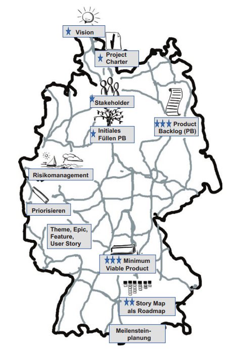
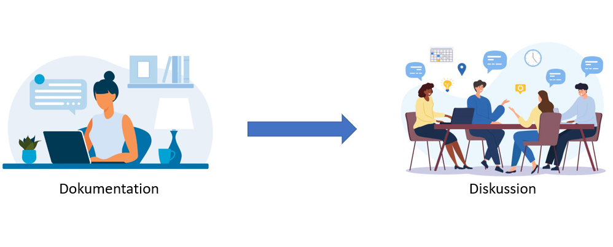

class: center, middle

## [Software Projektmanagement](index.html)

#### Kapitel 5

# Der rote Faden: Von der Projektvision zu Roadmap und Meilensteinen

Marlon Cadell

---
class: center, middle
# Projektplanung

---

???
* Die Vision
* * Um was genau soll es gehen? Was ist das Zielbild? Was soll erreicht werden?

* Project Charter=Projektauftrag
* * Warum wird das Projekt gemacht?
* * Was sind die messbaren Projektziele?
* * Was sind Inhalt und Umfang?
* * Wer ist beteiligt und betroffen (Stakeholder)?
* * Wo und mit welchen Ressourcen wird das Projekt durchgeführt?
* * Wann und in welchem Zeitrahmen soll das Projekt stattfnden?
* * Wie soll das Projekt umgesetzt werden?

* Stakeholder
* beispielsweise:
* * Der Sponsor,
* * der Projektleiter selbst,
* * Teammitglieder,
* * unternehmensinterne oder externe Kunden,
* * Betriebsrat sofern Personalveränderungen mit dem Projekt verbunden sind

* Das Product Backlog
In agilen Projekten ist das Product Backlog eine Aufstellung, die die zentrale Stelle
für alle Arbeit darstellt, die in einem Projekt zu leisten ist. 

* Themen, Epics, Features, User Stories, Tasks – To-dos in unterschiedlichem Detaillierungsgrad
* * Themen (Themes) sind wie grobe Überschriften
* * Epics und Features sind in der Regel größere Einheiten, noch relativ grob. Zerteilt man
die Epics oder Features weiter, entstehen meist aus einer Epic oder einem Feature mehrere User Stories

* Risiken und Nebenwirkungen – Risikomanagement
* * Dinge die das Erreichenunseres Projektziels fördern oder behindern können.

* Minimum Viable Product
* * sind Dinge, die zuerst gemacht werden müssen, damit zumindest Ideen getestet und Feedback von Stakeholdern eingeholt werden kann? Dies ist das sogenannte Minimum Viable Product (MVP).

* Die Roadmap – Story Map
* * Story Map wurden inhaltlich bereits die „Häppchen“ defniert

* Meilensteinplanung:
* * jetzt werden die Story Map Meilensteinlinien gelegt

---
class: center
# Shift
   

???
* Weniger ausgefeilte und umfangreiche Dokumentation des Wissens Einzelner und dafür mehr gemeinsame Diskussion und Aufbau gemeinsamen Wissens