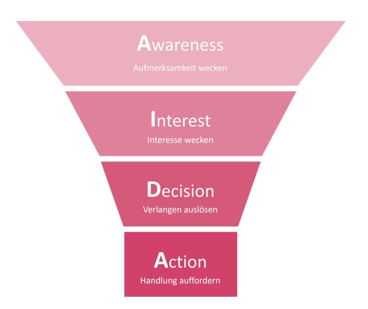
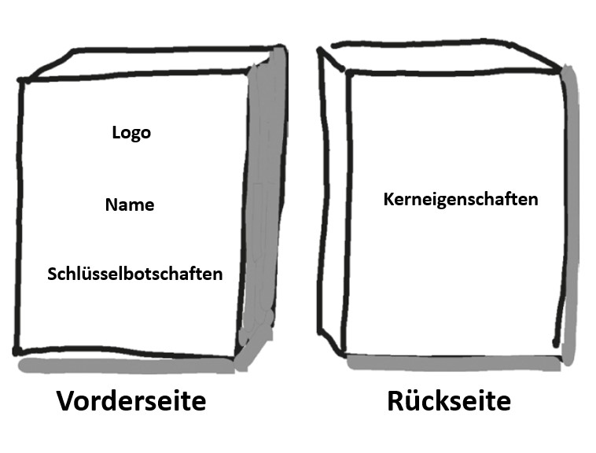

class: center, middle

## [Software Projektmanagement](index.html)

#### Kapitel 6

# Die Vision

Marlon Cadell

---
class: center, middle
# Entwicklung und Einsatz der Vision im Projekt

---
class: center
# Elevator Speech

???
* Für wen ist das Produkt/der Service?
* Was ist das Bedürfnis? Welche Chance bietet es, welches Problem adressiert es?
* Was ist das Produkt/der Service?
* Warum sollte der Gesprächspartner dieses Produkt/den Service „kaufen“ oder nutzen?
* Im Gegensatz zu welchen anderen Produkten/Services steht dies?
* Was macht dieses Produkt/der Service anders?
* Haben Sie eventuell noch einen Appell an Ihren Gesprächspartner, wie die Bitte um einen ausführlicheren Gesprächstermin?

* Workshop
* * Ziel = erarbeiten einer Vision in Form einer Kurzpräsentation
* * Dauer = 30 Minuten
* * Material = Flipchart-Papier für Stichpunkte, Stifte, eventuell auch Schere, buntes Papier
* * Vorbereitung = Keine spezielle
---

class: center, middle
# Product Box

???
* Workshop
* * Ziel = Erarbeiten der Vision mit den herausragenden Produktmerkmalen
* * Dauer = 1 h oder mehr, je nach Anzahl der Gruppen und der Diskussion
* * Material = Flipchart-Papier, Stifte, eventuell Kartons zum Bekleben mit dem Flipchart-Papier
* * Vorbereitung = Anleitung auf Flipchart-Papier
* * Gestalten von Vorder- und Rückseite: Herausarbeiten der Schlüsselbotschaften und wichtigsten Eigenschaften des Produktes/Projektergebnisses