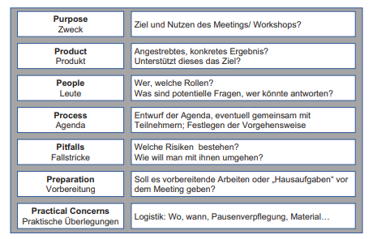

class: center, middle

## [Software Projektmanagement](index.html)

### Die Gestaltung von Meetings und Workshops

#### Kapitel 21

Angelo Mavridis
---
class: center, middle

## Was ist ein Meeting ?

## Was ist ein Workshop ?

---

## Was ist eine Moderation

Die Moderation ist eine Methode der Arbeit in und mit Gruppen

3 Rollen
 * Moderator
 * Teilnehmer 
 * Auftraggeber

---

## Moderator

 ### Was macht ein Moderator ?
 - Hilft den Teilnehmern den Weg zum Ziel zu finden
 - Kann eine Doppelrolle haben
 - Ist in der Regel komplet unparteisch und hälte seine eigenen Werte und Meinungen zurück
  
Am Ende kurze zusammenfassung der Ergebnise und Ausblicke erstellen\
möglichst kein Portokoll verwenden

 ### Wie hilft er den Teilnehmern?
 - Paraphrasieren 
 - Visualisren
    - Mindmaps
    - Flowchart
    - Ishikawa Diagramm
---
class: center, middle

### Phasen der Moderation

---
class: center, middle

 ### Vorbereitung Eines Meetings/Workshops

 

---
### Guppenfindung in kleinen gruppen

- Motive/Karten ziehen
- Abzählen
- Spielkarten ziehen
- Reihenfolge bilden
- Paar bildung durch Ketten

---

class: center, middle

 ### Systemisches Konsensieren

  