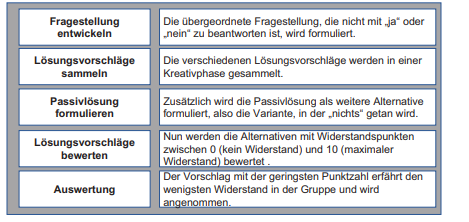

class: center, middle

## [Software Projektmanagement](index.html)

#### Kapitel 21
---
## was ist eine Moderation

>Die Moderation ist eine Methode der Arbeit in und mit Gruppen

3 Rollen
 * Moderator
 * Teilnehmer 
 * Auftraggeber

---

## Moderator

 ### Was macht ein Moderator ?
 - Hilft den Teilnehmern den Weg zum ziel zu finden
 - kann eine Doppelrolle haben
 - ist in der Regel kommplet unparteiisch und hälte seine eigenen Werte und Meinungen zurück
  
Am Ende kurze zusammenfassung der Ergebnise und Ausblicke erstellen\
möglichst kein Portokoll verwenden

 ### Wie hilft er den Teilnehmern?
 - Paraphrasieren 
 - Visualisren
    - Mindmaps
    - Flowchart
    - Ishikawa Diagramm
---
class: center, middle

 ### Vorbereitung es Moderators

 
 ---

class: center, middle

 ### Systemisches Konsensieren

  