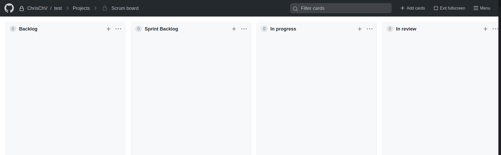

class: center, middle

## [Software Projektmanagement](index.html)

#### Projekt Management auf GitHub

Kirill Kuhn

# Vorwort
Alle Informationen werden aus den folgenden Quellen herausgenommen:

[Project Management on GitHub](https://www.topcoder.com/thrive/articles/project-management-on-github)

[Informationen zu Isses](https://docs.github.com/de/issues/tracking-your-work-with-issues/about-issues)

Informationen aus anderen Quellen werden mit [Zahl] vorgemerkt.

---
# Agenda
* Einführung - warum ein Projekt auf GitHub managen?
    * Was GitHub bereitstellt
        * Issues und Issue Linking
        * Markdown
        * Assignees
        * Labels
        * Projects
        * Milestone
        * Linked Pull Request
* Wie wird ein Projekt erstellt?
    * Backlog
    * Sprint Backlog
    * In progress
    * In review
    * Done
* Epic, Story und Task
* Informationen zu Issues

---
# Einführung - warum ein Projekt auf GitHub managen?
GitHub ist ein großer Werkzeugkasten, dass den Entwicklungsprozess von Projekten vereinfacht, vor allem, wenn diese Projekte sehr groß sind. Git erlaubt es einen Entwickler seinen Source Code zu versionieren und auf GitHub diese zu speichern und zu verwalten. 

Es existieren natürlich auch andere Werkzeuge, die dasselbe wie GitHub anbieten, also was ist der Unterschied?

GitHub hat mehrere Werkzeuge und bietet an, diese in den Code zu integrieren. Andere Werkzeuge bieten solches oft nicht an oder sind kostenpflichtig.

---
## Was Git bereitstellt
GitHub stellt verschiedene Werkzeuge bereit, um ein Projekt leichter zu gestalten, daran zuarbeiten und es zu administrieren.

### Issues und Issue Linking
_Issues_ sind Text Einträge mit denen Entwickler Bugs in einen Code publizieren, zukommende Features erklären oder die Stories und Tasks eines Users beschreiben können.
Jeder Issue bekommt eine bestimmte Nummer zugewiesen.

Im Falle, dass ein Issue eine Verbindung zu anderen Issues hat, zum Beispiel Issue #12 (ein Bug) ein Button funktioniert nicht und Issue #13 eine falsche Implementierung eines Codes, dann kann in Issue #12 auf Issue #13 wie folgt aufgeschrieben werden:

> Issue #12 (Bug)
>
> Button funktioniert nicht: #13

--> Issue Linking

---
### Markdown
Markdown ist ein Text Bearbeitungswerkzeug, womit Präsentationen, Protokolle und vieles mehr, ganz einfach in Word, PDFs, HTML und viele andere Formate verteilt werden kann.[1]

> Das Format in Markdowns bleibt immer gleich![1]

Markdown hat einen einfach zu lernenden Syntax und ist Platform unabhängig [1]. Dieser Dokument den Sie gerade lesen wurde auch in Markdown geschrieben!

---
### Assignees
In einem Repository gibt es die Möglichkeit die Mitglieder an Issues, Aufgaben oder Reviews zuweisen (Assignees). 
Somit ist es leichter zu sehen, wer welche Aufgabe hat und wofür wer zuständig ist.

---
### Labels
Labels sind Schlüsselwörter, womit durch Issues gesucht und gefiltert werden kann. Die Labels beschreiben
den Status des Issues, dessen essenzielle Information, dessen Wichtigkeit und ob es sich um ein Epic, User Stories oder Task handelt.

---
### Projects
Projects sind, strukturiere aufgebaute Tafel (Kanban-Board), worin Issues und Tasks im Repository übersichtlich hinzugefügt und bearbeitet werden können 
(mehr dazu in 'Wie wird ein Projekt erstellt?').

---
### Milestone
Milestones sind Issues, welche eine Deadline haben, zu welcher diese erledigt sein sollen. Dies ist sehr hilfreich für Sprints und User Stories.

---
### Linked Pull Request
Ein ganz normaler Pull Request ist, wenn ein Feature im main oder in ein privaten Branch hinzugefügt werden soll.
Hierbei kann ein Pull Request wie bei dem Issue Linking mit einem anderen Pull Request verlinkt werden.
Dies ist hilfreich, wenn man eine bessere Nachverfolgung in der Entwicklung haben möchte.

---
# Wie wird ein Projekt erstellt?
Ein Projekt oder auch ein "Scrum Board" hilft es in einem Projekt die Übersicht zu behalten. Wie wird er jetzt aber erstell?

Im Repository, unter projects, gibt es einen grünen Knopf 'Create a project'.
Hier kann man dann dem Scum Board einen Namen geben, eine Beschreibung und ein Template verwenden.

Darin können dann Elemente hinzugefügt und von Spalte zu Spalte verschoben werden.

---
## Backlog
Im Backlog werden aller User Stories gehalten.

---
## Sprint Backlog
Hier wird ausgesucht, welche User Stories aus dem Backlog bearbeitet werden.

---
## In Progress
Diese Spalte beinhaltet User Stories, welche momentan bearbeitet werden.

---
## In review
Nachdem User Stories aus der 'In Progress'-Spalte fertig bearbeitet wurden, werden diese zum Review in diese Spalte verschoben.
Sollte etwas eine User Story den Review nicht bestehen, wird diese wieder in die 'In Progress'-Spalte verschoben.

---
## Done
In dieser Spalte sind fertige User Stories.

---
# Epic, Story und Task
Was genau sind Epics, Stories und Tasks?

* Epic [2]
  * wenn mehrere Issues sich mit demselben Thema über das Projekt erstrecken
* (User) Story [3]
  * Erklärung eines Features aus der Perspektive des Users
  * folgen ein Template:
    * Als (User Type), möchte ich (Ziel), sodass (Erklärung).
* Task
  * wird immer zu einer User Story verlinkt
  * enthält eine Beschreibung der Aufgabe
  * enthält Assignees, welche diese Aufgabe erledigen sollen 

---
# Informationen zu Issues
Issues helfen ein Entwicklungsteam die Arbeit im Projekt zu organisieren und im überblick zu behalten.
Issues können verlinkt werden und können bei Pull Requests erwähnt werden, was dazu führt, dass die Issues
automatisch geschlossen werden, wenn der Pull Request akzeptiert wird.

Issues sind leicht zu erstellen und erlauben es Aufgaben, Notizen, Kommentare, bestimmte Codezeilen oder URL-Links
anzuzeigen. Zusätzlich kann man Projektmitarbeiter*innen mit '@' in einem Issue erwähnen.

Hat man ein Issue erstellt, so kann man diesen sehr leicht nachverfolgen, indem das Issue abonniert wird.
Somit erhält man eine Benachrichtigung, wenn ein Kommentar hinzugefügt wird oder wenn das Issue geschlossen wird.

---
class: center, middle

# Fragen?

---
# Quellen

[1]: Beginner Guide to Markdown , https://medium.com/@itsjzt/beginner-guide-to-markdown-229adce30074 , letzter Zugriff: 20.10.2023

[2]: Epics , https://docs.gitlab.com/ee/user/group/epics/ , letzter Zugriff: 25.10.2023

[3]: User Stories, https://www.mountaingoatsoftware.com/agile/user-stories , letzter Zugriff: 25.10.2023